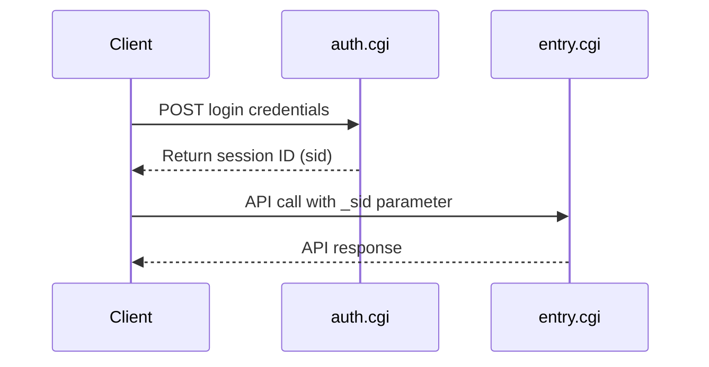

# Synology DSM API Documentation

[](docs/api-reference/)
[](docs/api-reference/)
[](docs/api-reference/activebackup/)
[](LICENSE)

> **Complete, unofficial API documentation for Synology DiskStation Manager (DSM)**
> Comprehensive coverage of DSM Core APIs, FileStation, DownloadStation, ActiveBackup, and more.

## 📚 Overview

This repository contains comprehensive documentation for Synology DSM APIs, including core system management, file operations, backup services, and application-specific APIs. Documentation is derived from official API definitions, systematic testing, and community contributions.

### What's Documented

**DSM Core APIs:**
- ✅ **FileStation** - File management, upload, download, sharing (20+ methods)
- ✅ **DownloadStation** - Download tasks, RSS, BT search (25+ methods)
- ✅ **System Info** - Hardware, network, services, packages (30+ methods)
- ✅ **User & Group Management** - Users, groups, permissions (15+ methods)
- ✅ **Storage & Shares** - Volume, share, snapshot management (20+ methods)
- ✅ **Network Services** - DHCP, VPN, certificates (10+ methods)

**Application APIs:**
- ✅ **ActiveBackup for Business** - 35 APIs, 215 methods (100% coverage)
- ✅ **Surveillance Station** - Camera management, recording (20+ methods)
- ✅ **Docker** - Container management (10+ methods)
- ✅ **Photos** - Photo library management (15+ methods)
- ✅ **Audio Station** - Music library management (10+ methods)

**Total Coverage:**
- ✅ **50+ API categories** documented
- ✅ **300+ methods** with examples and parameters
- ✅ Authentication flows and error handling
- ✅ Real-world usage examples in multiple languages

## 🚀 Quick Start

### 1. Authentication

```bash
curl "http://YOUR_NAS_IP:5000/webapi/auth.cgi" \
  -d "api=SYNO.API.Auth" \
  -d "version=6" \
  -d "method=login" \
  -d "account=YOUR_USERNAME" \
  -d "passwd=YOUR_PASSWORD" \
  -d "session=ActiveBackup" \
  -d "format=sid"
```

**Response:**
```json
{
  "data": {
    "sid": "YOUR_SESSION_ID"
  },
  "success": true
}
```

### 2. Make Your First API Call

**FileStation - List Files:**
```bash
curl "http://YOUR_NAS_IP:5000/webapi/entry.cgi" \
  -d "api=SYNO.FileStation.List" \
  -d "version=2" \
  -d "method=list" \
  -d "folder_path=/home" \
  -d "_sid=YOUR_SESSION_ID"
```

**ActiveBackup - Get Overview:**
```bash
curl "http://YOUR_NAS_IP:5000/webapi/entry.cgi" \
  -d "api=SYNO.ActiveBackup.Overview" \
  -d "version=1" \
  -d "method=get" \
  -d "_sid=YOUR_SESSION_ID"
```

👉 **[Full Quick Start Guide](docs/getting-started/quick-start.md)**

## 📖 Documentation

### Getting Started
- **[Quick Start Guide](docs/getting-started/quick-start.md)** - Get up and running in 5 minutes
- **[Authentication](docs/getting-started/authentication.md)** - How to authenticate with the API
- **[Common Patterns](docs/getting-started/common-patterns.md)** - Common usage patterns and best practices

### API Reference
- **[API Reference Overview](docs/api-reference/README.md)** - Complete API reference
- **[DSM Core APIs](docs/api-reference/core/)** - System, User, Group, Package management
- **[FileStation](docs/api-reference/filestation/)** - File operations, upload, download, sharing
- **[DownloadStation](docs/api-reference/downloadstation/)** - Download management, RSS, BT search
- **[Storage & Shares](docs/api-reference/storage/)** - Volume, share, snapshot management
- **[Network Services](docs/api-reference/network/)** - DHCP, VPN, certificates
- **[ActiveBackup for Business](docs/api-reference/activebackup/)** - Backup, restore, device management
- **[Surveillance Station](docs/api-reference/surveillance/)** - Camera and recording management
- **[Application APIs](docs/api-reference/apps/)** - Docker, Photos, Audio Station, etc.

### Guides
- **[Backup Workflows](docs/guides/backup-workflows.md)** - Common backup scenarios
- **[Restore Workflows](docs/guides/restore-workflows.md)** - Restore operations
- **[Error Handling](docs/guides/error-handling.md)** - Error codes and troubleshooting
- **[Best Practices](docs/guides/best-practices.md)** - API best practices

### Examples
- **[Python Examples](docs/examples/python/)** - Complete Python examples
- **[JavaScript Examples](docs/examples/javascript/)** - Node.js examples
- **[cURL Examples](docs/examples/curl/)** - Command-line examples

## 🏗️ Architecture

### API Categories

| Category | APIs | Methods | Description |
|----------|------|---------|-------------|
| **DSM Core** | 10 | 50+ | System info, users, groups, packages, certificates |
| **FileStation** | 15 | 60+ | File management, upload, download, sharing, compression |
| **DownloadStation** | 8 | 30+ | Download tasks, RSS feeds, BT search |
| **Storage** | 6 | 25+ | Volumes, shares, snapshots, RAID |
| **Network** | 5 | 20+ | DHCP, VPN, network interfaces |
| **ActiveBackup** | 35 | 215 | Device backup, restore, versioning, AEM, VM backup |
| **Surveillance** | 8 | 40+ | Cameras, recording, events, live view |
| **Applications** | 10 | 50+ | Docker, Photos, Audio Station, Note Station |

### Authentication Flow



## 📊 API Coverage

**DSM APIs:**
- **Total API Categories:** 50+
- **Total Methods:** 300+
- **Fully Documented:** 200+ methods
- **With Response Examples:** 100+ methods

**ActiveBackup APIs:**
- **Total APIs:** 35
- **Total Methods:** 215
- **Fully Tested:** 74 methods (34%)
- **Parameter Requirements Documented:** 141 methods (66%)
- **Coverage:** 100%

## 🔑 Key Features

### Complete Coverage
Every single method from the official API definition is documented with either full response examples or detailed parameter requirements.

### Real API Responses
74 methods include actual JSON responses captured from a live Synology NAS running ActiveBackup for Business.

### Systematic Discovery
Documentation generated through systematic testing using the official API definition file, not guesswork.

### Multiple Languages
Examples provided in Python, JavaScript, and cURL for easy integration.

## 🛠️ Use Cases

- **File Management Automation** - Automate file operations, uploads, downloads
- **Backup Automation** - Automate backup tasks and monitoring with ActiveBackup
- **Download Management** - Programmatically manage downloads and torrents
- **System Monitoring** - Build custom monitoring dashboards for DSM
- **User & Permission Management** - Automate user and group administration
- **Storage Management** - Monitor and manage volumes, shares, snapshots
- **Integration** - Integrate Synology NAS with other systems and platforms
- **Custom Applications** - Build custom applications on top of DSM APIs

## ⚠️ Disclaimer

This is **unofficial documentation** created through reverse-engineering. It is not endorsed by or affiliated with Synology Inc. Use at your own risk.

## 📄 License

MIT License - See [LICENSE](LICENSE) file for details

## 🤝 Contributing

Contributions welcome! Please see [CONTRIBUTING.md](CONTRIBUTING.md) for guidelines.

## 📞 Support

- **Issues:** [GitHub Issues](https://github.com/pmilano1/synology-activebackup-api/issues)
- **Discussions:** [GitHub Discussions](https://github.com/pmilano1/synology-activebackup-api/discussions)

---

**Made with ❤️ by the community**

